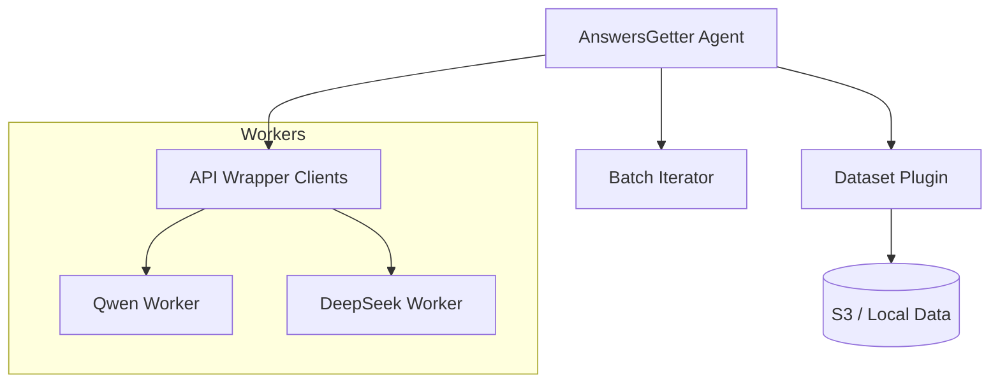

# Technical Design: Orchestrator Updates & AnswersGetter Agent

Этот документ описывает изменения в Оркестраторе для поддержки HPM и архитектуру агента AnswersGetter для эффективного сбора ответов моделей.

## 1. Обновления Оркестратора (HPM-Aware Orchestrator)

Оркестратор переходит от простого запуска контейнеров к управлению динамическими окружениями через HPM.

### 1.1. Генерация Lock-файлов
Перед запуском задачи инференса, Оркестратор вызывает `hpm lock` (как библиотеку или CLI), чтобы зафиксировать зависимости плагина.

```python
# Псевдокод логики Оркестратора
def prepare_inference_env(model_cfg):
    if model_cfg.run_mode == "prod":
        # Генерируем детерминированный lock для плагина
        lock_content = hpm.generate_lock(
            plugins=[model_cfg.adapter_name],
            mode="prod"
        )
        return {"HPM_LOCK_B64": base64.b64encode(lock_content)}
    else:
        # Режим разработки: прокидываем пути к локальным исходникам
        return {
            "RUN_MODE": "dev",
            "HPM_DEV_OVERLAY": json.dumps({model_cfg.adapter_name: model_cfg.local_path})
        }
```

### 1.2. Запуск контейнера (Docker API)
Оркестратор настраивает `ENTRYPOINT` контейнера на `hpm` и передает контекст через переменные окружения.

*   **Image**: `vlmhyperbench/base-gpu:latest` (содержит только `uv` и `hpm`).
*   **Env**: `HPM_LOCK_B64` или `HPM_DEV_OVERLAY`.
*   **Command**: `run --entrypoint serve`.

## 2. Агент AnswersGetter

AnswersGetter — это изолированный компонент (также запускаемый через HPM), который координирует процесс получения ответов от моделей.

### 2.1. Архитектура компонента



### 2.2. Workflow работы
1.  **Initialization**: HPM устанавливает `dataset-plugin` (например, для чтения SNILS датасета).
2.  **Iteration**: `BatchIterator` запрашивает данные у плагина.
3.  **Dispatch**: AnswersGetter отправляет асинхронные запросы (HTTP) воркерам.
4.  **Collection**: Ответы (текст + метрики инференса) собираются и передаются в `DataLayer` для сохранения.

### 2.3. Манифест AnswersGetter (hpm.yaml)
```yaml
name: "answers-getter"
type: "service"
dependencies:
  - name: "dataset_factory"
  - name: "api_wrapper" # для клиента
entrypoints:
  run: "python -m answers_getter.main --config config.yaml"
```

## 3. Схема Графа Знаний (Integrated Schema)

Для поддержки Memory Bank и структуры HPM, мы расширяем схему Neo4j:

### Узлы (Nodes)
*   `HPM_Package`: {name, version, type}
*   `Entrypoint`: {name, command}
*   `ADR`: {id, title, status, text}
*   `Requirement`: {id, description}

### Связи (Relationships)
*   `(Package)-[:DEPENDS_ON]->(Package)`
*   `(Package)-[:HAS_ENTRYPOINT]->(Entrypoint)`
*   `(ADR)-[:AFFECTS]->(Package)`
*   `(Requirement)-[:IMPLEMENTED_BY]->(Package|Entrypoint)`
*   `(Entrypoint)-[:STARTS_PROCESS]->(Function)` (связь с кодом)

Это позволяет нам спрашивать: *"Какие требования (Requirements) затронет изменение этого Entrypoint?"*.