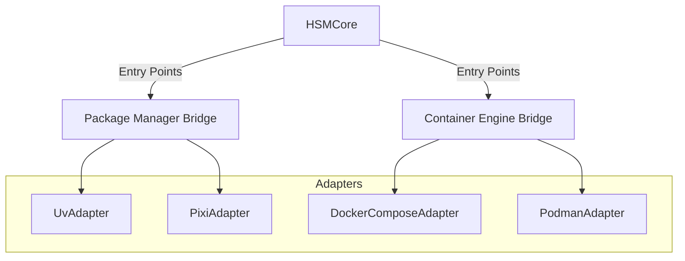

# Technical Design: Adapters (Package Managers & Container Engines)

## 1. Обзор
Концепция адаптеров позволяет HSM быть независимым от конкретных инструментов. HSM управляет "намерениями" (какие группы и пакеты выбраны в `hsm.yaml`), а адаптеры отвечают за "материализацию" этих намерений в конкретной среде.

Адаптеры разделены на две категории:
1.  **Package Managers**: Управление Python-зависимостями.
2.  **Container Engines**: Управление инфраструктурными сервисами.



## 2. Архитектура и Регистрация

### 2.1. Динамическая загрузка (Entry Points)
Адаптеры не импортируются жестко в ядро. Вместо этого используется механизм **Python Entry Points**, что позволяет добавлять новые адаптеры без изменения кода `HSMCore`.

Регистрация в `pyproject.toml`:
```toml
[project.entry-points."hsm.package_managers"]
uv = "hyper_stack_manager.adapters.python_uv:UvAdapter"

[project.entry-points."hsm.container_engines"]
docker = "hyper_stack_manager.adapters.container_docker:DockerComposeAdapter"
```

### 2.2. Базовые классы
Все адаптеры наследуются от абстрактных классов в `hsm/src/hyper_stack_manager/adapters/base.py`.

#### BasePackageManagerAdapter
```python
class BasePackageManagerAdapter(ABC):
    @abstractmethod
    def sync(self, packages: List[str], frozen: bool = False):
        """Materialize dependencies into the environment."""
        pass

    @abstractmethod
    def lock(self):
        """Generate lock file."""
        pass

    @abstractmethod
    def init_lib(self, path: Path):
        """Initialize a new library/package at the given path."""
        pass
```

#### BaseContainerAdapter
```python
class BaseContainerAdapter(ABC):
    @abstractmethod
    def generate_config(self, services: List[Dict[str, Any]]):
        """Generate orchestration configuration (e.g., docker-compose.yml)."""
        pass

    @abstractmethod
    def up(self, services: Optional[List[str]] = None):
        """Start services."""
        pass

    @abstractmethod
    def down(self):
        """Stop and remove services."""
        pass
```

## 3. Реализованные адаптеры

### 3.1. UvAdapter (Package Manager)
Использует `uv` для управления зависимостями.
*   **Механизм**: Обновляет секцию `[project.dependencies]` в `pyproject.toml` с использованием `tomlkit`.
*   **Команды**: `uv sync`, `uv lock`, `uv init --lib`.

### 3.2. DockerComposeAdapter (Container Engine)
Управляет контейнерами через Docker Compose.
*   **Механизм**: Генерирует `docker-compose.hsm.yml` на основе манифестов из реестра.
*   **Команды**: `docker compose up -d`, `docker compose down`.

## 4. Планируемые адаптеры
*   **PixiAdapter**: Для управления системными зависимостями.
*   **PodmanAdapter**: Альтернатива Docker для безрутовых сред.

## 5. Выбор адаптера
Адаптер выбирается динамически:
*   **Package Manager**: На основе `project.manager` в `hsm.yaml`.
*   **Container Engine**: На основе `project.container_engine` в `hsm.yaml` (по умолчанию `docker`).