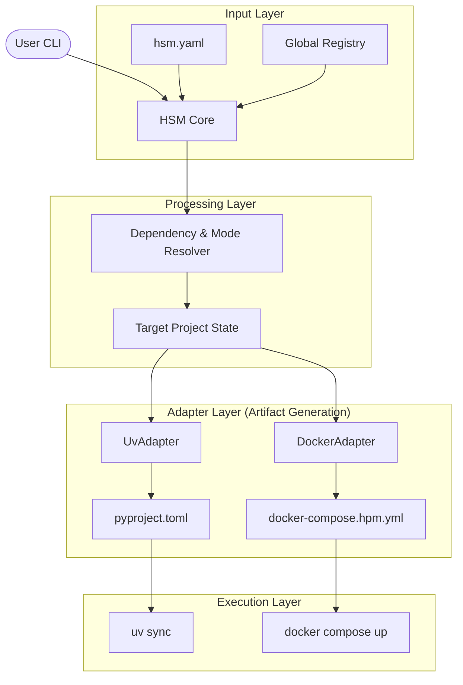

# Technical Design: HSM Meta-Orchestration Architecture

Этот документ описывает внутреннее устройство **Hyper Stack Manager (hsm)** и взаимодействие его ключевых компонентов.

## 1. Концептуальная схема

## 2. Ключевые компоненты

### 2.1. HSM Core & Manifest Engine
Центральный узел, который управляет жизненным циклом операции.
*   **Manifest Engine**: Использует `ruamel.yaml` для чтения и записи `hsm.yaml`. Обеспечивает "Round-Trip" редактирование, сохраняя комментарии пользователя.
*   **Transaction Manager**: Гарантирует атомарность. Если адаптер сообщает об ошибке (например, `uv` не смог разрешить зависимости), HSM откатывает изменения в артефактах.

### 2.2. Registry Manager
Оперирует распределенной базой знаний.
*   **Packages**: Метаданные Python-пакетов (источники, версии).
*   **Containers**: Метаданные Docker-образов и правила их сборки.
*   **Groups**: Логические объединения (1-of-N / M-of-N), позволяющие выбирать реализации интерфейсов.

### 2.3. Adapter Layer (Backend Agnostic)
Адаптеры — это "рабочие лошадки", которые знают специфику конкретных инструментов.
*   **UvAdapter**:
    *   Транслирует `hsm.yaml` -> `pyproject.toml`.
    *   Управляет секцией `[project.dependencies]`.
    *   Вызывает `uv sync`.
*   **DockerAdapter**:
    *   Транслирует `hsm.yaml` -> `docker-compose.hpm.yml`.
    *   Управляет переключением `image` vs `build`.
    *   Инжектирует `volumes` для режима `dev`.

## 3. Процесс синхронизации (Reconciliation Loop)

1.  **Load**: Чтение `hsm.yaml` и локального состояния.
2.  **Resolve**: Запрос к Реестру для получения полных метаданных выбранных компонентов.
3.  **Plan**: Формирование "желаемого состояния" для каждого адаптера.
4.  **Execute**:
    *   Адаптеры обновляют файлы (`pyproject.toml`, `docker-compose.hpm.yml`).
    *   Запускаются внешние команды (`uv sync`).
5.  **Finalize**: Если всё успешно — сохранение обновленного `uv.lock` и завершение транзакции.

## 4. Расширяемость
Архитектура позволяет легко добавлять новые адаптеры (например, `PixiAdapter` или `PipAdapter`), реализуя базовый интерфейс `BaseAdapter`. Это делает HSM универсальным инструментом, не зависящим от моды на конкретные пакетные менеджеры.