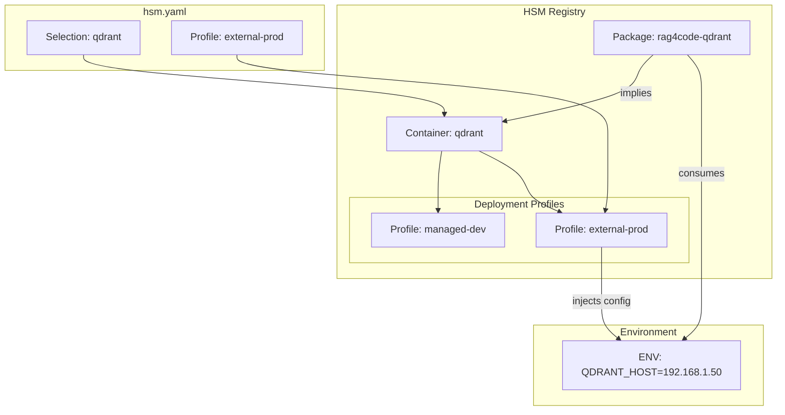

# Dependency Implication (Implies)

## Обзор

Механизм **Implies** (Подразумевает) позволяет описывать декларативные зависимости между компонентами системы, находящимися в разных группах. Это ключевой инструмент для реализации концепции "Meta-Orchestration", позволяющий одной опции (например, выбору клиента базы данных) автоматически конфигурировать связанные части системы (например, сервис базы данных в Docker).

## Проблема

В модульных системах часто возникает сильная связность между кодом (пакетами) и инфраструктурой (контейнерами).
Например:
*   Если мы используем пакет `rag4code-qdrant` (клиент), нам **обязательно** нужен запущенный контейнер `qdrant`.
*   Если мы переключаемся на `rag4code-milvus`, нам нужно заменить контейнер `qdrant` на `milvus`.

Без механизма автоматизации пользователю приходится вручную синхронизировать выбор в разных группах, что ведет к ошибкам конфигурации.

## Решение: Implies

Мы добавляем поле `implies` в определение опции группы в реестре. Это поле содержит список требований к другим группам, которые должны быть удовлетворены, если выбрана данная опция.

### Структура YAML

```yaml
# hsm-registry/package_groups/vector-db.yaml
name: vector-db
type: package_group
strategy: 1-of-N
options:
  - name: rag4code-qdrant
    description: "Qdrant Adapter"
    implies:
      # Требование: В группе контейнеров 'infra' должен быть выбран 'qdrant'
      container_group:infra: qdrant
      
  - name: rag4code-milvus
    description: "Milvus Adapter"
    implies:
      container_group:infra: milvus
```

## Поведение HSM

При выполнении команды добавления опции в группу (например, `hsm group add vector-db --option rag4code-qdrant`), HSM выполняет следующие шаги:

1.  **Анализ**: Считывает определение выбранной опции (`rag4code-qdrant`) из реестра.
2.  **Обнаружение Implies**: Находит секцию `implies`.
3.  **Рекурсивное разрешение**: Для каждого требования в `implies`:
    *   Проверяет, существует ли целевая группа в проекте.
    *   Если нет — добавляет её.
    *   Проверяет стратегию целевой группы (`1-of-N` или `M-of-N`).
    *   **Применяет выбор**:
        *   Для `1-of-N`: Заменяет текущий выбор на требуемый (или выдает ошибку конфликта, см. ниже).
        *   Для `M-of-N`: Добавляет требуемую опцию к списку выбранных (идемпотентно).
4.  **Отчет**: Сообщает пользователю о всех автоматически сделанных изменениях.

## Сценарии и Кейсы

### Кейс 1: Простая зависимость (1-to-1)
**Сценарий**: Выбор клиента БД тянет за собой сервис БД.
*   **Действие**: `hsm group add vector-db --option rag4code-qdrant`
*   **Результат**:
    *   В `package_groups` выбрано `rag4code-qdrant`.
    *   В `container_groups` (группа `infra`) автоматически выбрано `qdrant`.

### Кейс 2: Комплексный стек (1-to-M)
**Сценарий**: Выбор "Full Stack Auth" тянет за собой БД, Redis и почтовый сервис.
*   **Опция**: `auth-full-stack`
*   **Implies**:
    *   `infra -> postgres`
    *   `infra -> redis`
    *   `infra -> mailhog`
*   **Результат**: В группу `infra` (стратегия `M-of-N`) добавляются все три контейнера.

### Кейс 3: Цепочка зависимостей (Transitive)
**Сценарий**: Опция A требует B, а B требует C.
*   `Option A` implies `Group B -> Option B`
*   `Option B` implies `Group C -> Option C`
*   **Результат**: При выборе A, HSM рекурсивно выберет и B, и C.

## Проверки и Конфликты

HSM выполняет строгие проверки для предотвращения некорректных состояний:

1.  **Конфликт 1-of-N**:
    *   Если пользователь выбирает Опцию A, которая требует `infra -> postgres`.
    *   И одновременно выбирает Опцию B, которая требует `infra -> mysql`.
    *   А группа `infra` имеет стратегию `1-of-N` (только одна БД).
    *   **Результат**: Ошибка валидации. Пользователь должен разрешить конфликт вручную (например, сменив стратегию группы на `M-of-N` или выбрав совместимые опции).

2.  **Циклические зависимости**:
    *   Если A требует B, а B требует A.
    *   **Результат**: HSM обнаруживает цикл и корректно обрабатывает его (идемпотентность), либо прерывает выполнение, если цикл приводит к бесконечному переключению (в случае `1-of-N` конфликтов).

3.  **Отсутствие группы/опции**:
    *   Если `implies` ссылается на несуществующую группу или опцию в реестре.
    *   **Результат**: Ошибка валидации манифеста.

## Преимущества

*   **Декларативность**: Зависимости описаны явно в реестре, а не скрыты в скриптах установки.
*   **Целостность**: Гарантирует, что инфраструктура соответствует коду.
*   **Удобство**: Пользователь делает один высокоуровневый выбор, а система достраивает детали.

## Service-Centric Configuration (BYOI)

Для поддержки сценариев **Bring Your Own Infrastructure (BYOI)**, когда пользователь хочет использовать существующий внешний сервис вместо запуска нового контейнера, HSM вводит концепцию **Deployment Profiles** (Профили развертывания).

### Архитектура Профилей (в Реестре)

Детали подключения и режим работы (`managed` или `external`) описываются в реестре, внутри определения контейнера. Это позволяет инкапсулировать сложность инфраструктуры и переиспользовать конфигурации между проектами.

**Пример `hsm-registry/containers/qdrant.yaml`:**
```yaml
name: qdrant
type: container
# ... базовые параметры ...

deployment_profiles:
  # Профиль для локальной разработки (Docker)
  managed-dev:
    mode: managed
    container_name: qdrant-dev
    ports: ["6333:6333"]
    env:
      QDRANT__SERVICE__API_KEY: "dev-secret"

  # Профиль для продакшена (Внешний кластер)
  external-prod:
    mode: external
    external:
      host: "${QDRANT_PROD_HOST}" # Берется из .env
      port: 6333
      api_key: "${QDRANT_PROD_KEY}"
```

### Использование в Проекте (`hsm.yaml`)

В манифесте проекта пользователь просто выбирает нужный профиль.

```yaml
services:
  container_groups:
    vector-db-service:
      selection: qdrant
      profile: external-prod  # Ссылка на профиль из реестра
```

### Взаимодействие с Implies

1.  **Managed Profile**:
    *   HSM генерирует сервис в `docker-compose.hsm.yml`.
    *   Пробрасывает имя сервиса Docker как хост в зависимые пакеты.

2.  **External Profile**:
    *   HSM **не генерирует** контейнер.
    *   Берет параметры (`host`, `port`, `api_key`) из профиля в реестре.
    *   Пробрасывает их в зависимые пакеты через переменные окружения.

### Преимущества
*   **Чистота проекта**: `hsm.yaml` содержит только намерения, а не детали реализации.
*   **Единый источник правды**: Изменение адреса базы в реестре автоматически распространяется на все проекты.
*   **Безопасность**: Секреты передаются через ENV-переменные, на которые ссылается профиль.

## Схема связей (Data Flow)

