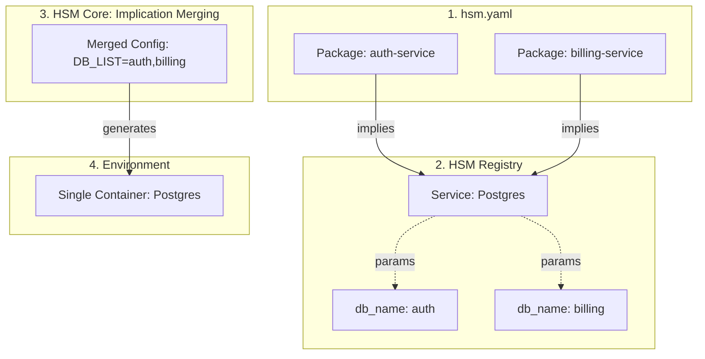
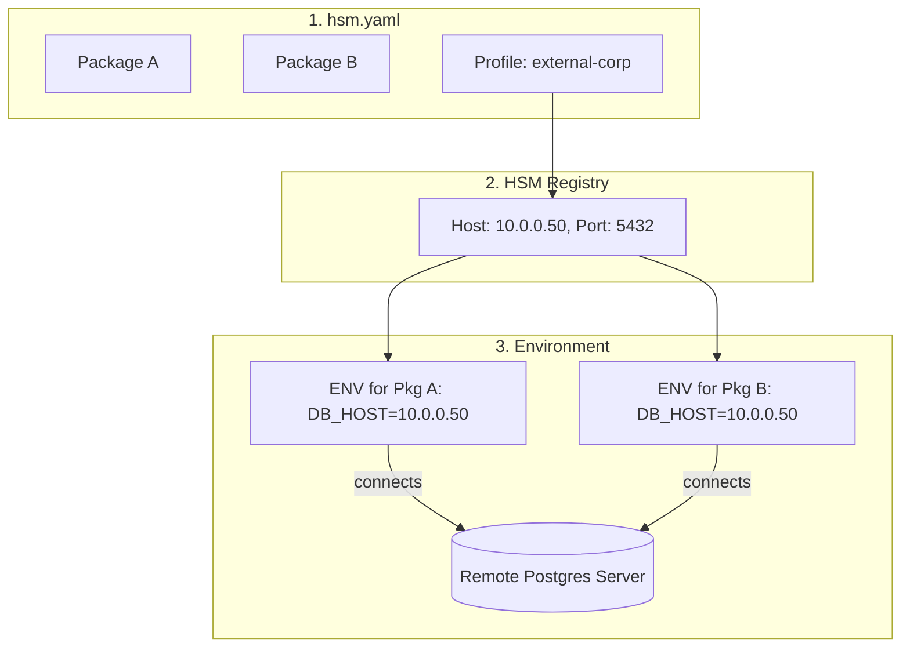
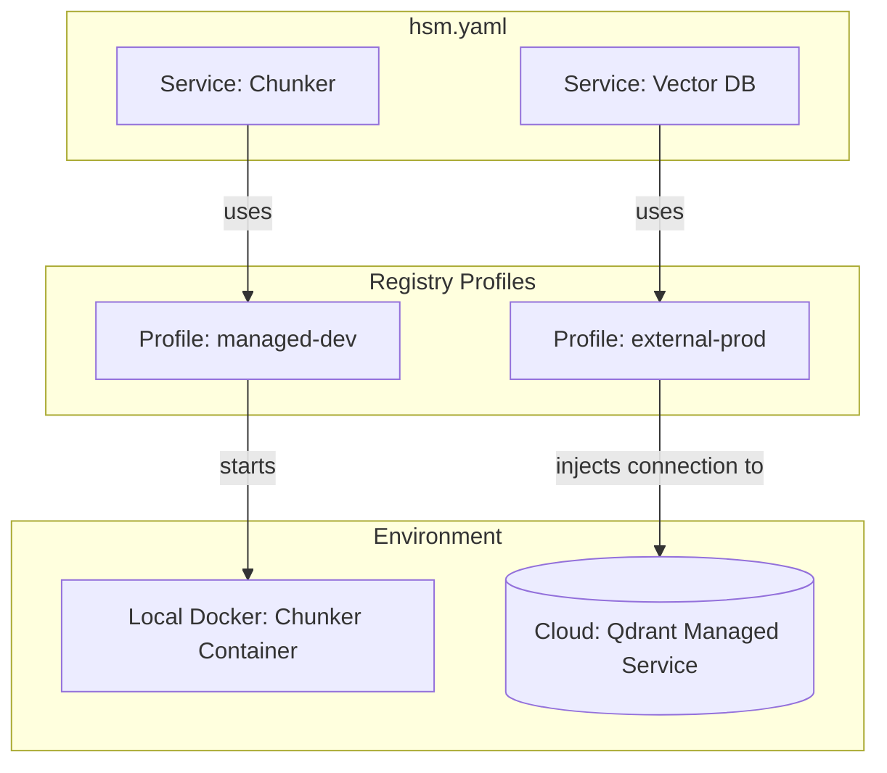

# Technical Design: Сложные кейсы конфигурации HSM

Этот документ описывает продвинутые сценарии использования HSM, демонстрирующие гибкость системы при работе с инфраструктурой и зависимостями.

## Кейс 1: "Один на всех" (Shared Service)

Сценарий, когда несколько компонентов системы используют один и тот же физический или логический ресурс.

### 1.1. Слияние в Managed режиме (Shared Container)
**Проблема**: Несколько пакетов требуют одну и ту же СУБД. Мы хотим запустить один контейнер, но создать в нем разные базы.

### 1.2. Общий доступ в External режиме (Shared Remote DB)
**Проблема**: Много пакетов должны подключиться к одной удаленной БД, параметры которой описаны в реестре.

---

## Кейс 2: "Гибридное облако" (Hybrid BYOI)

**Проблема**: Разработчик хочет использовать локальный Chunker (в Docker), но подключаться к мощной векторной БД в облаке (External).

---

## Кейс 3: "Симметричная разработка" (Editable Stack)

**Проблема**: Нужно одновременно вносить изменения в два зависимых пакета (например, в ядро системы и в плагин).

**Решение**: Использование **Editable Sources** в реестре. При выполнении `hsm sync`, HSM (через `uv`) установит пакет как ссылку на локальную папку. Любое изменение кода мгновенно отразится на работе всего стэка.

---

## Кейс 4: "Секреты без утечек" (Zero-Leak Secrets)

**Проблема**: Нужно передать API ключи в контейнеры и пакеты, не сохраняя их в Git.

**Решение**: **Variable Interpolation**. HSM считывает значение из системного окружения или `.env` файла в момент синхронизации (`${MY_SECRET}`). В YAML-файлах остаются только ссылки.