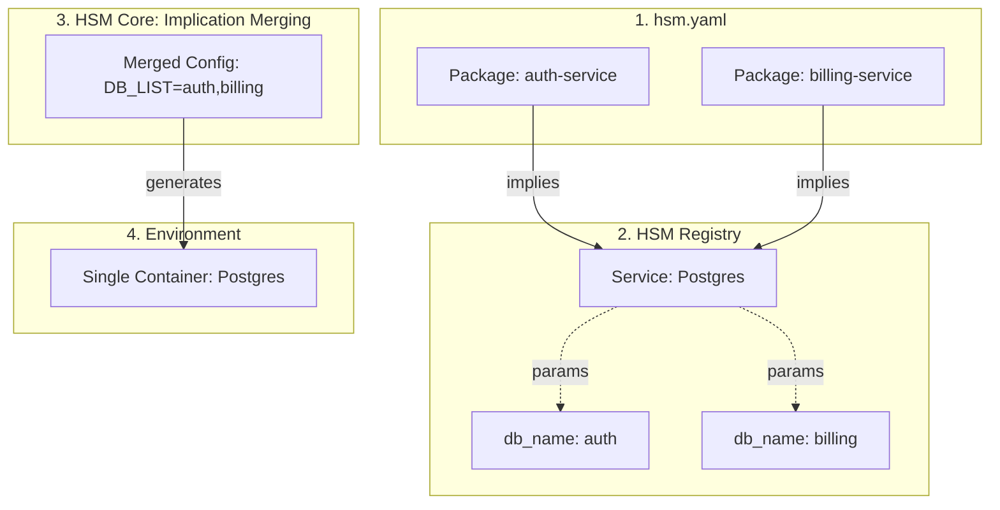
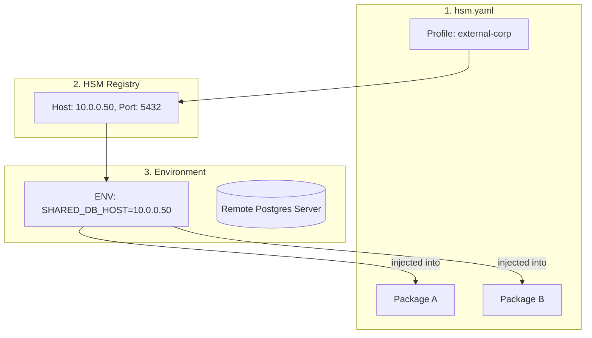
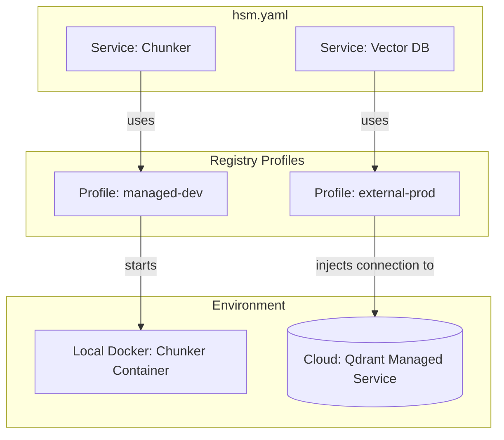
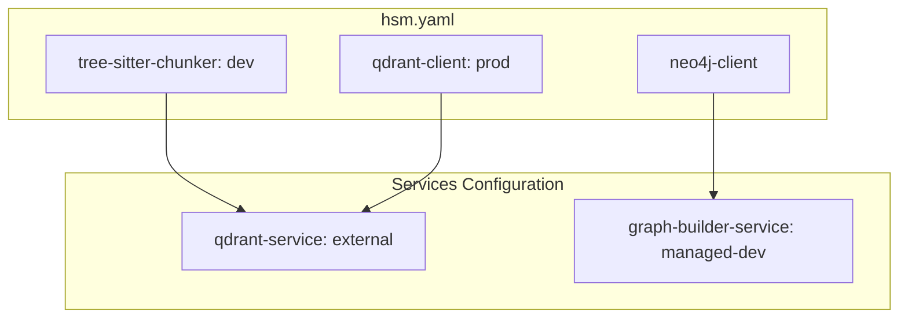

# Technical Design: Сложные кейсы конфигурации HSM

Этот документ описывает продвинутые сценарии использования HSM, демонстрирующие гибкость системы при работе с инфраструктурой и зависимостями.

---

## Кейс 1: "Один на всех" (Shared Service)

Сценарий, когда несколько компонентов системы используют один и тот же физический или логический ресурс.

### 1.1. Слияние в Managed режиме (Shared Container)
**Задача**: Несколько пакетов требуют одну и ту же СУБД. Мы хотим запустить один контейнер, но создать в нем разные базы.



**Как это работает**:
HSM анализирует зависимости всех выбранных пакетов. Если несколько пакетов ссылаются на один и тот же идентификатор контейнера в реестре, HSM выполняет **Implication Merging** (слияние намерений).

**Примеры конфигураций**:

1.  **Пакет 1 (Auth)** (`registry/packages/auth-service.yaml`):
    ```yaml
    name: auth-service
    implies:
      container:postgres:
        params:
          db_name: "auth_db"
    ```

2.  **Пакет 2 (Billing)** (`registry/packages/billing-service.yaml`):
    ```yaml
    name: billing-service
    implies:
      container:postgres:
        params:
          db_name: "billing_db"
    ```

3.  **Сервис (Postgres)** (`registry/containers/postgres.yaml`):
    ```yaml
    name: postgres
    env:
      # HSM соберет все параметры 'db_name' от всех пакетов в этот список
      POSTGRES_MULTIPLE_DATABASES: "${HSM_MERGED_PARAMS.db_name}"
    ```

4.  **Манифест проекта** (`hsm.yaml`):
    ```yaml
    packages:
      - auth-service
      - billing-service
    # HSM сам достроит секцию services, обнаружив общую зависимость
    ```

---

### 1.2. Общий доступ в External режиме (Shared Remote DB)
**Задача**: Много пакетов должны подключиться к одной удаленной БД, параметры которой описаны в реестре.



**Как это работает**:
Конфигурация внешнего сервера описывается один раз в **Профиле Реестра**. Проект просто ссылается на профиль. Это обеспечивает принцип DRY (Don't Repeat Yourself) для инфраструктуры.

**Примеры конфигураций**:

1.  **Реестр сервиса** (`registry/containers/qdrant.yaml`):
    ```yaml
    name: qdrant
    deployment_profiles:
      external-corp:
        mode: external
        external:
          host: "10.0.0.50"
          port: 6333
    ```

2.  **Манифест проекта** (`hsm.yaml`):
    ```yaml
    services:
      container_groups:
        vector-db:
          selection: qdrant
          profile: external-corp # Все клиенты qdrant в проекте подключатся к 10.0.0.50
    ```

---

## Кейс 2: "Гибридное облако" (Hybrid BYOI)

**Задача**: Разработчик хочет использовать локальный Chunker (в Docker), но подключаться к мощной векторной БД в облаке (External).



**Как это работает**:
HSM позволяет смешивать режимы развертывания в рамках одного проекта. Для каждого сервиса или группы сервисов можно указать свой профиль из реестра.

**Пример конфигурации `hsm.yaml`**:
```yaml
services:
  container_groups:
    chunker-service:
      selection: local-chunker
      profile: managed-dev    # Будет запущен локальный контейнер через Docker Compose
    
    vector-db-service:
      selection: qdrant
      profile: external-prod  # Контейнер не запустится, будут проброшены параметры облака
```

---

## Кейс 3: "Комбинированный стек" (Hybrid Stack)

**Задача**: Реализовать сложную схему, где разные части системы работают в разных режимах развертывания одновременно.



**Как это работает**:
HSM одновременно управляет и внешними связями, и локальными контейнерами, обеспечивая прозрачное взаимодействие между ними:
*   **Внешний сервис**: `tree-sitter-chunker` и `qdrant-client` автоматически получают параметры подключения (host, port, api_key) к внешнему Qdrant из соответствующего профиля в реестре.
*   **Локальный сервис**: `neo4j-client` подключается к `graph-builder-service`, который HSM автоматически запускает как локальный контейнер через Docker Compose.
*   **Изоляция**: Разработчик просто выбирает нужные пакеты и профили, а HSM берет на себя всю "грязную работу" по пробросу переменных окружения и оркестрации.

---

## Кейс 4: "Симметричная разработка" (Editable Stack)

**Задача**: Нужно одновременно вносить изменения в клиентский пакет и сервис, с которым он работает (например, `neo4j-client` и `graph-builder-service`).

**Как это делает HSM**:
Использование **Editable Sources** в реестре. При выполнении `hsm sync`, HSM (через `uv`) установит пакет как ссылку на локальную папку, а сервис запустит из локального контекста сборки. Любое изменение кода в папках разработчика мгновенно отразится на работе всего стэка.

**Примеры конфигураций**:

1.  **Пакет (Neo4j Client)** (`registry/packages/neo4j-client.yaml`):
    ```yaml
    name: neo4j-client
    sources:
      dev:
        type: local
        path: "../../packages/neo4j-client"
        editable: true # Установка через 'uv pip install -e'
    ```

2.  **Сервис (Graph Builder)** (`registry/containers/graph-builder-service.yaml`):
    ```yaml
    name: graph-builder-service
    sources:
      dev:
        type: build
        path: "../../services/graph-builder"
        dockerfile: "Dockerfile.dev"
    ```

3.  **Манифест проекта** (`hsm.yaml`):
    ```yaml
    packages:
      - neo4j-client: dev
    services:
      container_groups:
        graph-services:
          selection: graph-builder-service
          profile: managed-dev
          mode: dev
    ```

---

## Кейс 5: "Секреты без утечек" (Zero-Leak Secrets)

**Задача**: Нужно передать API ключи и порты в контейнеры и пакеты (например, для `neo4j-client: prod` и `graph-builder-service: managed-prod`), не сохраняя их в Git.

**Как это делает HSM**:
**Variable Interpolation**. HSM считывает значения из системного окружения или `.env` файла в момент синхронизации. В YAML-файлах реестра и проекта остаются только безопасные ссылки.

**Примеры конфигураций**:

1.  **Пакет (Neo4j Client)** (`registry/packages/neo4j-client.yaml`):
    ```yaml
    name: neo4j-client
    env:
      NEO4J_PASSWORD: "${NEO4J_PROD_PASSWORD}"
      NEO4J_PORT: "${NEO4J_PROD_PORT}"
    ```

2.  **Сервис (Graph Builder)** (`registry/containers/graph-builder-service.yaml`):
    ```yaml
    name: graph-builder-service
    deployment_profiles:
      managed-prod:
        mode: managed
        ports:
          - "${NEO4J_PROD_PORT}:7474"
        env:
          DB_PASSWORD: "${NEO4J_PROD_PASSWORD}"
    ```

3.  **Манифест проекта** (`hsm.yaml`):
    ```yaml
    packages:
      - neo4j-client: prod
    services:
      container_groups:
        graph-services:
          selection: graph-builder-service
          profile: managed-prod
          mode: prod
    ```