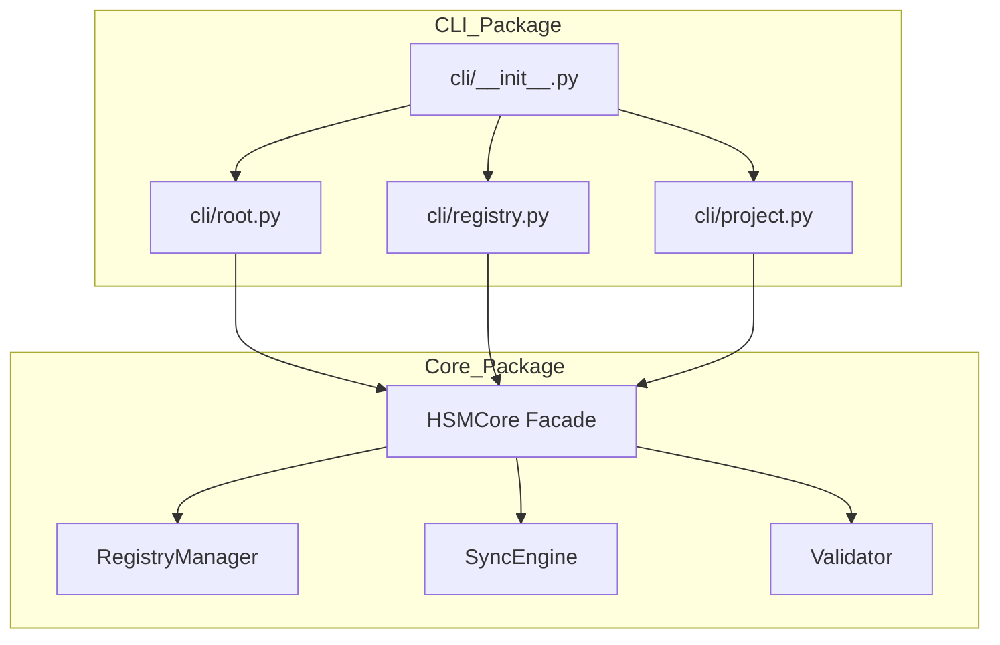

# Архитектура: Рефакторинг HSM Core & CLI

## Контекст
Проект значительно вырос, что привело к появлению монолитных файлов `core.py` (>700 строк) и `cli.py` (>600 строк). Этот документ описывает стратегию рефакторинга для разделения этих компонентов на модульные пакеты с использованием паттерна Facade.

## Архитектурная диаграмма

## Рефакторинг Core (`hsm/src/hyper_stack_manager/core/`)

Класс `HSMCore` будет выступать в роли **Facade**, делегируя ответственность специализированным менеджерам.

### Компоненты
1.  **`engine.py` (Facade)**:
    *   Основная точка входа (`HSMCore`).
    *   Хранит общее состояние: `project_root`, `manifest`, `registry_path`.
    *   Инициализирует суб-менеджеры.
    *   Делегирует вызовы методов.

2.  **`registry_manager.py`**:
    *   **Ответственность**: CRUD операции для глобального реестра.
    *   **Методы**: `search`, `add_package`, `add_container`, `add_group`, `remove`, `get_details`.

3.  **`sync_engine.py`**:
    *   **Ответственность**: Разрешение зависимостей и синхронизация окружения.
    *   **Методы**: `sync`.
    *   **Логика**:
        *   Резолвинг пакетов/контейнеров из манифеста.
        *   Обработка логики `implies` и **Implication Merging**.
        *   Оркестрация адаптеров (`uv`, `docker`).

4.  **`validator.py`**:
    *   **Ответственность**: Валидация и проверки dry-run.
    *   **Методы**: `check`.

## Рефакторинг CLI (`hsm/src/hyper_stack_manager/cli/`)

CLI будет разделен на функциональные модули для улучшения навигации и расширяемости.

### Компоненты
1.  **`__init__.py`**:
    *   Инициализирует приложение `typer.Typer`.
    *   Импортирует и регистрирует подкоманды.

2.  **`root.py`**:
    *   Команды верхнего уровня: `init`, `sync`, `check`, `list`, `mode`.

3.  **`registry.py`**:
    *   Команды в группе `hsm registry ...`.
    *   Подгруппы: `package`, `group`, `container`, `path`.

4.  **`project.py`**:
    *   Команды управления текущим проектом.
    *   Группы: `package`, `group`, `container`, `python-manager`.

5.  **`utils.py`**:
    *   Общие утилиты: функции автодополнения, настройка логирования, помощники для Rich console.

## План миграции
1.  **Core Split**: Сначала рефакторинг `core.py`, так как CLI зависит от него.
2.  **CLI Split**: Рефакторинг `cli.py` для использования новой структуры Core.
3.  **Verification**: Запуск `hsm check` и существующих тестов.