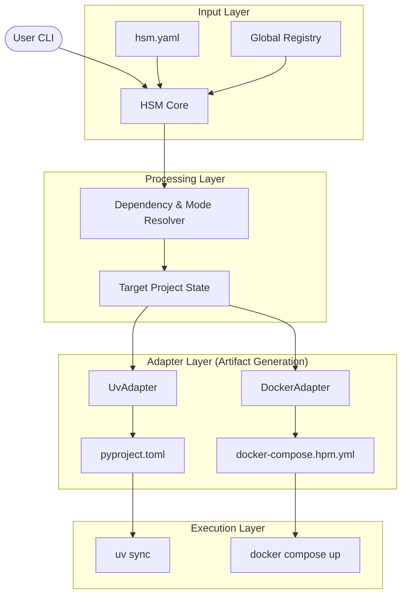

# Technical Design: HSM Meta-Orchestration Architecture

Этот документ описывает внутреннее устройство **Hyper Stack Manager (hsm)** и взаимодействие его ключевых компонентов.

## 1. Концептуальная схема

## 2. Ключевые компоненты

### 2.1. HSMCore (Facade)
Центральный оркестратор, реализующий паттерн **Facade**. Он не содержит бизнес-логики, а делегирует её специализированным менеджерам. Это обеспечивает модульность и упрощает тестирование.

### 2.2. Sync Engine & Implication Merging
"Мозг" системы. Отвечает за:
*   **Dependency Resolution**: Сбор всех необходимых компонентов из манифеста и реестра.
*   **Implication Merging**: Уникальный механизм слияния параметров. Если несколько пакетов требуют один и тот же контейнер, Sync Engine объединяет их требования (например, список баз данных для одного Postgres) в единую конфигурацию.

### 2.3. Registry Manager
Инкапсулирует работу с глобальным реестром (`hsm-registry/`).
*   **Packages/Containers/Groups**: CRUD операции и поиск.
*   **Isolation**: Поддерживает `HSM_REGISTRY_PATH` для работы с альтернативными или тестовыми реестрами.

### 2.4. Validator
Реализует логику `hsm check`. Выполняет dry-run проверку целостности проекта, наличия компонентов в реестре и отсутствия конфликтов в `implies`.

### 2.5. Adapter Layer (Backend Agnostic)
Адаптеры — это "рабочие лошадки", которые знают специфику конкретных инструментов.
*   **UvAdapter**:
    *   Транслирует `hsm.yaml` -> `pyproject.toml`.
    *   Управляет секцией `[project.dependencies]`.
    *   Вызывает `uv sync`.
*   **DockerAdapter**:
    *   Транслирует `hsm.yaml` -> `docker-compose.hpm.yml`.
    *   Управляет переключением `image` vs `build`.
    *   Инжектирует `volumes` для режима `dev`.

## 3. Процесс синхронизации (Reconciliation Loop)

1.  **Load**: Чтение `hsm.yaml` и локального состояния.
2.  **Resolve**: Запрос к Реестру для получения полных метаданных выбранных компонентов.
3.  **Plan**: Формирование "желаемого состояния" для каждого адаптера.
4.  **Execute**:
    *   Адаптеры обновляют файлы (`pyproject.toml`, `docker-compose.hpm.yml`).
    *   Запускаются внешние команды (`uv sync`).
5.  **Finalize**: Если всё успешно — сохранение обновленного `uv.lock` и завершение транзакции.

## 4. Расширяемость
Архитектура позволяет легко добавлять новые адаптеры (например, `PixiAdapter` или `PipAdapter`), реализуя базовый интерфейс `BaseAdapter`. Это делает HSM универсальным инструментом, не зависящим от моды на конкретные пакетные менеджеры.